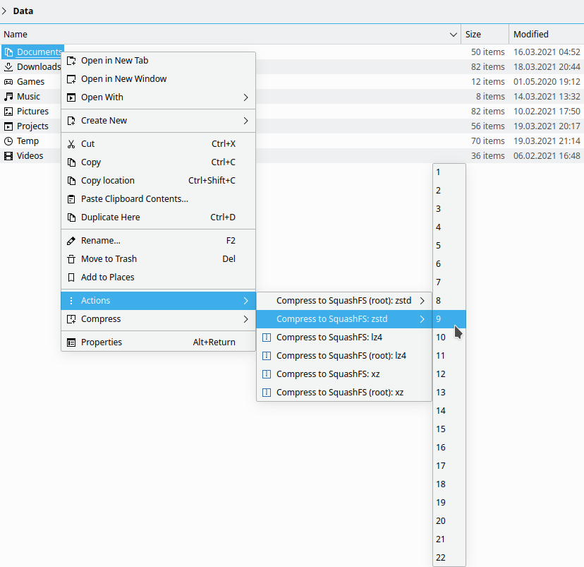

## Dolphin service menu: Compress to SquashFS

Useful for backups and other purposes as SquashFS can be easily mounted. See also [SquashFS mounter / unmounter](https://github.com/shvchk/dolphin-squashfs-mount)

